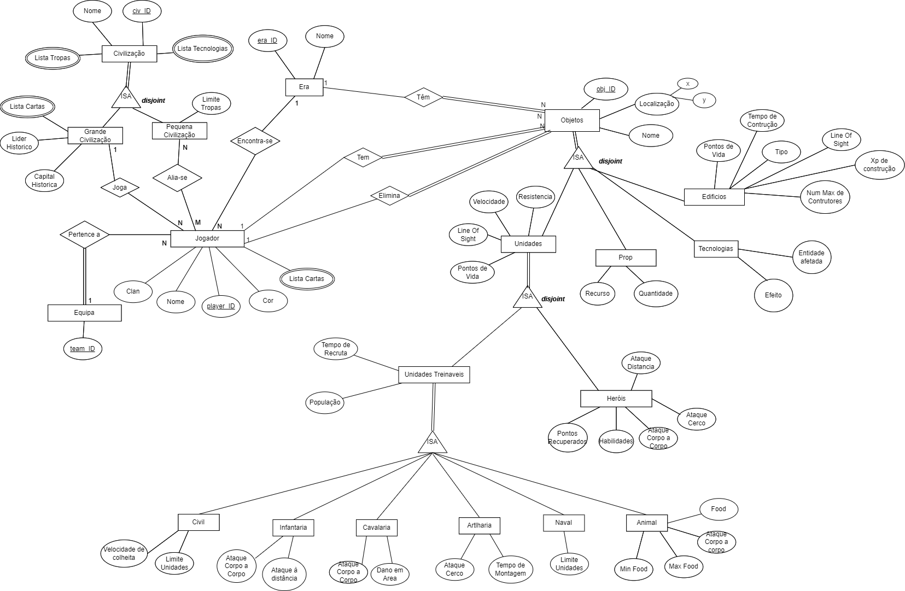
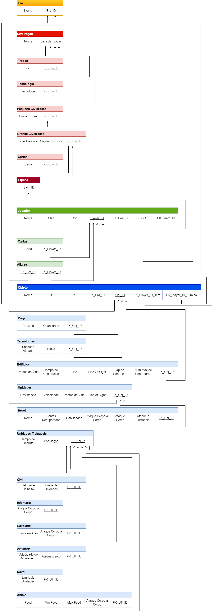
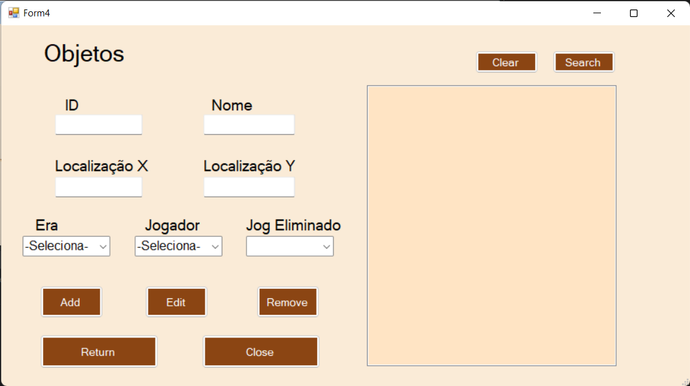
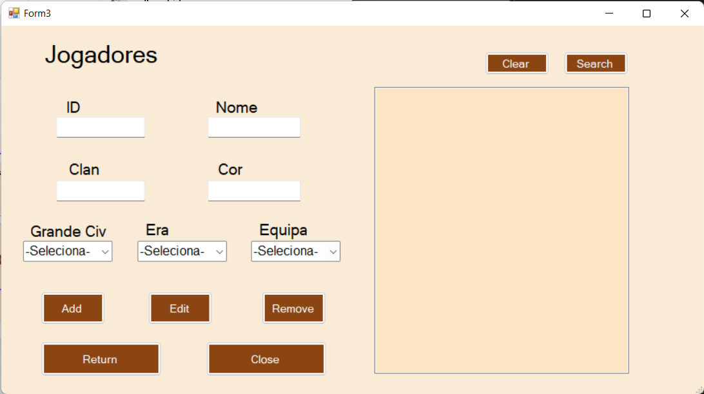
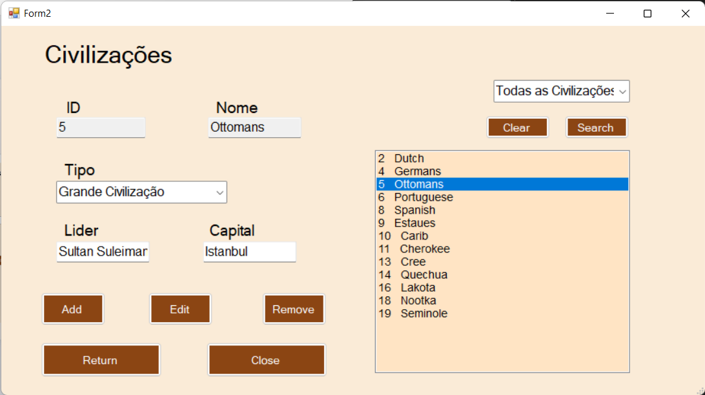

# BD: Trabalho Prático APF-T

**Grupo**: P4G6

- Rafael Ferreira, MEC: 107340
- Rodrigo Graça, MEC: 107634

---

## Introdução / Introduction

Vamos tentar modelar um pós-jogo de uma batalha online de Age of Empires 3. Nesta batalha poderão participar duas a quatro equipas, para um total de 2 a 8 jogadores. Durante o jogo são criados vários objetos, alguns ainda permanecem enquanto outros desapareceram. Iremos assim por fim guardar todos esses objetos, para posteriormente analisar informações relativas ao jogo, como por exemplo, o número de tropas totais, ou o número de unidades civis. Bem como comparar diferentes objetos uns com os outros.

---

## ​Análise de Requisitos / Requirements

- Jogo é jodago por um número de jogadores que podem formar equipas, mais o jogador neutro/natureza.
- **Equipa**: é caracterizada únicamente pelo seu identificador.
- **Jogador**: é caracterizado por um identificador único, um nome, uma cor (opcional), um clan (opcional). Em cima disso um jogador deverá escolher uma Grande Civilização e uma equipa. Durante o jogo, o jogador encontra-se constantemente numa Era. Um jogador poderá também se aliar a uma Pequena Civilização. O jogador poderá ter também um baralho de cartas.
- **CartaJogador**: é caracterizada pela carta, e pelo jogador a que pertence.
- **Civilização**: é caracterizada pelo seu nome e um identificador único. Têm também de ser: Pequena Civilização ou Grande Civilização. Uma civilização tem também uma lista de cartas;
- **Pequena Civilização**: é caracterizada pelo limite de tropas.
- **Grande Civilização**: é caracterizada por um líder histórico e uma capital histórica.
- **Alia**: caracteriza a aliança de um jogador a uma pequena civilização através de um identificador do jogador, e um identificador da civilização.
- **Era**: é caracterizada por um identificador único e um nome.
- **Objetos**: pertencem a jogadores, podendo ser eliminados por qualquer um dos jogadores. Encontram-se ligados a uma Era. São caracterizados por um identificador único, por um nome (obrigatório), e por par de coordenadas (X e Y), representantes da sua localização. São também obrigatoriamente pertencentes a um dos seguintes grupos: Edifícios, Tecnologias, Props ou Vivos.
- **Edifícios**: são caracterizados por Pontos de vida, Tempo de construção, Tipo, linha de visão, número máximo de construtores, XP de construção.
- **Tecnologia**: são caracterizadas como entidade afetada e efeiro.
- **Prop**: é caracterizado por tipo de recurso e a quantidade do recurso.
- **Unidades**: Caracterizam-se por ter Pontos de Vida, Linha de Visão, Velocidade e Resistência. São de dois tipos: Unidades Treinável ou Herói.
- **Herói**: são caracterizados por Ataque Distancia, Ataque de Cerco, Ataque Corpo a Corpo, Habilidades, Pontos Recuperados.
- **Unidades treináveis**: caracterizam-se por Tempo de Recruta, XP de Recruta e População.
- Unidades Treináveis pertencem a 6 Tipos - Civil, Infantaria, Cavalaria, Artilharia, Naval e Animal.
- **Civil**: caracteriza-se por Velocidade de colheita e Limite de Unidades.
- **Infantaria**: caracteriza-se pelo seu Ataque Corpo a Corpo e Ataque à Distância.
- **Cavalaria**: caracteriza-se pelo seu Ataque Corpo a Corpo e Dano em Area
- **Artilharia**: caracteriza-se pelo seu Ataque Cerco e a sua Velocidade de Montagem
- **Naval**: caracteriza-se pelo seu limite de unidades.
- **Animal**: caracteriza-se pelo min Food, max Food, Food e Ataque Corpo a Corpo.

---

## DER - Diagrama Entidade Relacionamento/Entity Relationship Diagram

### Versão final/Final version



### APFE

Em suma, alteramos as ações do jogador sobre os objetos, em que previamente apenas constava que o jogar os tinha e agora o jogador pode também eliminá-los.
Nas Unidades Treinaveis, retiramos bastantes dados que eram exagerados e desnecessários tornando o diagrama mais simples e de facil compreensão.
Na Artilharia alteramos o atributo 'Velocidade de Montagem' para 'Tempo de Montagem', é uma pequena correção porque o objetivo sempre foi ser 'Tempo'.
Foram feitas mais algumas alterações para remover a informação excessiva. Removeu-se XP_Recruta de Unidades_Treinaveis, nas tabelas Cavalaria e Artelharia foram removidos os atributos Ataque_Distancia. Da tabela Naval foram removidos os atributos Ataque Distancia e Cerco.
Com o mesmo intuito os atributos Parametro e Quantidade na tabela Tecnologia foram substituidos por Efeito.
Removeu-se também Nome de Heroi (uma vez que já existia em objeto).

---

## ER - Esquema Relacional/Relational Schema

### Versão final/Final Version



### APFE

Foram feitas as mesmas alterações que no DER, verificar na sequecção anterior quais foram as modificações feitas.
Mais alguns bug fixes, atributos errados dispostos na tabela que não tinhamos reparado antes e que agora a fazer o ddl reparamos, como 'Bonus de cerco' constava em vez de 'Line of Sight' nas Unidades, 'Ataque Cerco' constava duas vezes em vez de aparecer 'Ataque à Dsitancia' nos Herois e nas Unidades Treinaveis.

---

## ​SQL DDL - Data Definition Language

Segue-se agora todo o código sql necessário a criação do SCHEMA e de todas as TABLE's com as suas respetivas Primary e Foreign Keys.

[SQL DDL File](sql/01_ddl.sql "SQLFileQuestion")

---

## SQL DML - Data Manipulation Language

### Form Objetos



```sql

-- Primeiro passo é ir buscar a informação necessária como:
    -- Jogadores
SELECT nome, jogador_id
FROM Empires.Jogador
    -- Era
SELECT nome, era_id
FROM Empires.Era


/* SELECIONAR */
-- Selecionar todos os Objetos
SELECT *
FROM Empires.Objeto

/* INSERIR */
-- Inserir um novo Objeto
INSERT INTO Empires.Objeto (obj_id, nome, localizacao_x, localizacao_y, FK_jogador_id_tem, FK_jogador_id_elimina, FK_era_id)
VALUES (@obj_id, @nome, @localizacao_x, @localizacao_y, @FK_jogador_id_tem, @FK_jogador_id_elimina, @FK_era_id)

/* ALTERAR */
-- Alterar um Objeto
UPDATE Empires.Objeto
SET nome = @novo_nome, localizacao_x = @novo_localizacao_x, localizacao_y = @novo_localizacao_y, FK_era_id =@novo_FK_era_id, FK_jogador_id_tem = @novo_FK_jogador_id_tem, FK_jogador_id_elimina = @novo_FK_jogador_id_elimina
WHERE obj_ID = @obj_id

-- Uma vez que temos ON UPDATE CASCADE, não é necessário alterar os dependentes.

/* ELIMINAR */
-- Eliminar uma Civilizacao
DELETE FROM Empires.Objeto
WHERE obj_id = @obj_id

-- Uma vez que temos ON DELETE CASCADE, não é necessário remover os dependentes.

```

### Form Jogadores



```sql

-- Primeiro passo é ir buscar a informação necessária como:
    -- Civilizacoes
SELECT ID, Nome
FROM Empires.Todas_Civilizacao
WHERE Lider IS NOT NULL;
    -- Equipa
SELECT equipa_id
FROM Empires.Equipa
    -- Eras
SELECT nome, era_id
FROM Empires.Era


/* SELECIONAR */
-- Selecionar todas os Jogadores
SELECT *
FROM Empires.Jogador

/* INSERIR */
-- Inserir um novo Jogador
INSERT INTO Empires.Jogador (jogador_id, nome, clan, cor, FK_grande_id, FK_equipa_id, FK_era_id)
VALUES (@jogador_id, @nome, @clan, @cor, @FK_grande_id, @FK_equipa_id, @FK_era_id)

/* ALTERAR */
-- Alterar um Jogador
UPDATE Empires.Jogador
SET nome = @novo_nome, clan = @novo_clan, cor = @novo_cor,FK_grande_id = @novo_FK_grande_id, FK_equipa_id = @novo_FK_equipa_id, FK_era_id = @novo_FK_era_id
WHERE jogador_ID = @jogador_id

-- Uma vez que temos ON UPDATE CASCADE, não é necessário alterar os dependentes.

/* ELIMINAR */
-- Eliminar um Jogador
DELETE FROM Empires.Jogador
WHERE jogador_id = @jogador_id

-- Uma vez que temos ON DELETE CASCADE, não é necessário remover dependentes.

-- Temos também duas últimas queries, (visível com double click na listbox), para retornar:
    -- o número de cartas de um Jogador
SELECT Empires.GetTotalCardsPerPlayer(@jog_id)
AS NumberCards
    -- o número de objetos de um Jogador
SELECT Empires.GetTotalObjectsPerPlayer(@jog_id)
AS NumberObjects
```

### Form Civilizacoes



```sql
/* SELECIONAR */
-- Seleciona as Grandes Civilizações
SELECT ID, Nome, Lider, Capital
FROM Empires.Todas_Civilizacao
WHERE Lider IS NOT NULL;

-- Seleciona as Pequenas Civilizações
SELECT ID, Nome, Limite_Tropas
FROM Empires.Todas_Civilizacao
WHERE Limite_Tropas IS NOT NULL

-- Selecionar todas as Civilizações
SELECT *
FROM Empires.Todas_Civilizacao

/* INSERIR */
-- Inserir uma nova Civilizacao
EXEC Empires.InsertCivilizacao  @Nome = @nome, @FK_grande_id = @id;

-- De seguida inseri-la em Grande Civilizacao
INSERT INTO Empires.Grande_Civilizacao (FK_civ_id, lider, capital)
VALUES (@FK_civ_id, @lider, @capital);

-- Ou inseri-la em Pequena Civilizacao
INSERT INTO Empires.Pequena_Civilizacao (FK_civ_id, limite_tropas)
VALUES (@FK_civ_id, @limite_tropas);

/* ALTERAR */
-- Alterar uma Civilizacao
UPDATE Empires.Civilizacao
SET nome = @novo_nome
WHERE civ_ID = @civ_id

-- Uma vez que temos ON UPDATE CASCADE, não é necessário alterar os FK's nas Grandes e Pequenas Civilizacoes. Basta apenas alterar a informação relativa a essas.

-- De alterar em Grande Civilizacao
UPDATE Empires.Grande_Civilizacao
SET lider =@novo_lider, capital = @novo_capital
WHERE FK_civ_ID = @FK_civ_id

-- Ou altera-la em Pequena Civilizacao
UPDATE Empires.Pequena_Civilizacao
SET limite_tropas =@novo_limite_tropas
WHERE FK_civ_ID = @FK_civ_id

/* ELIMINAR */
-- Eliminar uma Civilizacao
DELETE FROM Empires.Civilizacao
WHERE civ_id = @civ_id

-- Uma vez que temos ON DELETE CASCADE, não é necessário remover das Grandes e Pequenas Civilizacoes

-- Temos também uma última query para retornar o número de cartas de uma civilização (visível com double click na listbox)
SELECT Empires.GetTotalCardsPerCivilizacao(@civ_id)
AS NumberCards
```

---

## Normalização/Normalization

Toda a base de dados encontra-se na forma normal de Boyce-Codd. Isto foi uma preocupação desde o início, e para tal desda concepção do DER e do ER que isto foi tomado em conta. O único obstáculo a isto foi atributos multivalor, os quais foram transformados nas suas próprias tabelas.

---

## Índices/Indexes

Foi criado um conjunto de índices. Incialmente tomamos em consideração todas as chaves primárias, e todas as chaves estrangeiras, como colunas candidatas a ter índices. Após alguma deliberacão, e alguns testes - cientes de que a quantidade de dados, não é suficiente para dar garantias - decidimos criar índices nas:

- Chaves primárias, cujas tabelas contêm várias colunas com dados do tipo VARCHAR(N). A intencão é reduzir a quantidade de informação nas páginas reduzindo os tempos de procura.
- Chaves estrangeiras. A intenção é agilizar a procura uma vez que utilizamos várias vezes pesquisar pelas FKs.

Poe fim reduzimos para os seguintes:
[SQL Indexes File](sql/06_indexes.sql "SQLFileQuestion")

Este conjutnto corresponde a Primary Keys cujas tabelas tenham muita informação do tipo VARCHAR(50) a preenchar as páginas de pesquisa, e Foreign Keys, pelas quais pesquisamos várias vezes.

---

## SQL Programming: Stored Procedures, Triggers, UDF

<p style="text-indent:30px;">
    Após a implementação inicial do projeto, passamos a utilizar Stored Procedures (Procedimentos Armazenados) e UDFs (Funções Definidas pelo Usuário). Essas ferramentas foram adotadas porque as Stored Procedures nos ajudam a melhorar o desempenho, a segurança e a manutenção do banco de dados. Com as Stored Procedures, podemos encapsular um conjunto de comandos SQL em um único bloco de código executável, o que resulta em execuções mais rápidas e redução do tráfego de rede. Além disso, elas permitem controlar o acesso aos dados e simplificar a manutenção do código, centralizando as lógicas e regras de negócio no banco de dados.
</p>
<p style="text-indent:30px;">
    Já as UDFs são utilizadas para criar funções personalizadas que podem ser usadas em consultas SQL. Essas funções nos ajudam a simplificar as consultas, tornando-as mais legíveis e facilitando a reutilização do código. Com as UDFs, podemos encapsular lógicas complexas ou cálculos específicos, promovendo a reutilização do código e tornando as consultas mais eficientes.
</p>
<p style="text-indent:30px;">
    No geral, a adoção de Stored Procedures e UDFs após a implementação inicial do projeto foi uma estratégia para melhorar o desempenho das operações de banco de dados, garantir a segurança dos dados, simplificar a manutenção do código e promover a reutilização do código em consultas SQL.
</p>

[SQL SPs and Functions File](sql/02_sp_functions.sql "SQLFileQuestion")

Ao contrário das Stored Procedures e UDFs, tivemos que utilizar Triggers logo desde o ínicio, nomeadamente para permitir eliminar e atualizar dados relativos ao Jogador, sem criar conflitos.

[SQL Triggers File](sql/03_triggers.sql "SQLFileQuestion")

---

## Outras notas/Other notes

Incluímos também o código para efetuar um DROP de tudo.

[SQL Drop File](sql/07_drops.sql "SQLFileQuestion")

---

### Dados iniciais da dabase de dados/Database init data

Aqui encontramos por fim, todas as inserções íniciais, para permitir a inicialização do projeto.

[SQL Insert File](sql/04_insert.sql "SQLFileQuestion")
